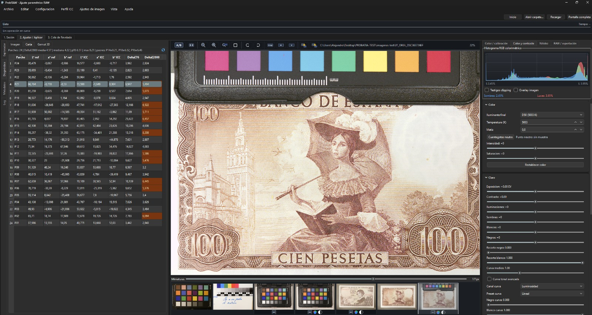
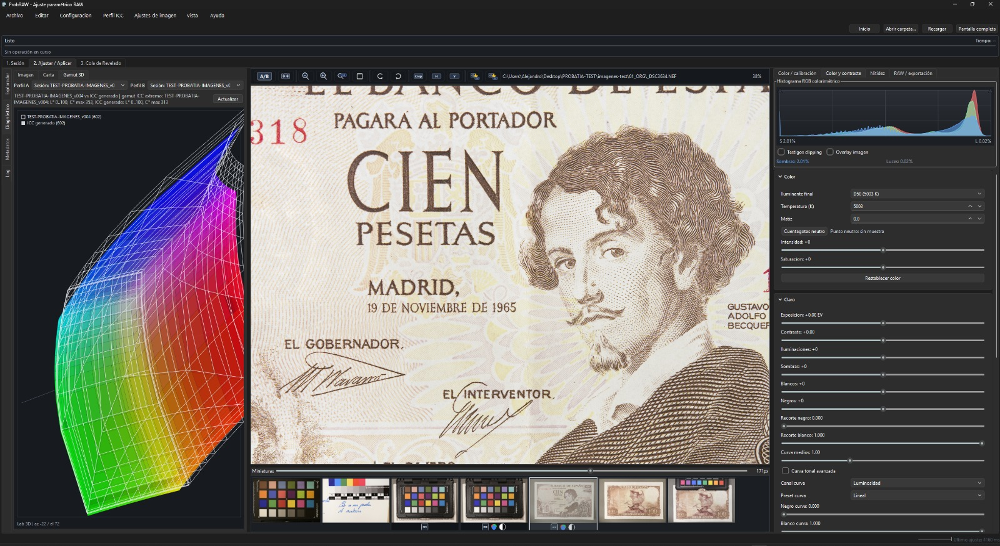
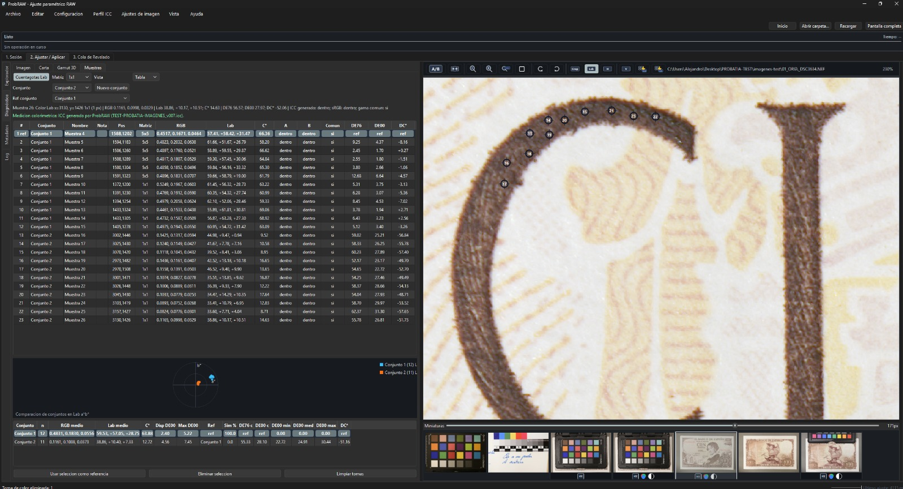

_Versión en español: [MANUAL_USUARIO.es.md](MANUAL_USUARIO.es.md)_

# ProbRAW User Manual

ProbRAW is a free and open application for RAW/TIFF development with
reproducible criteria, ICC color management and traceability. It is designed for
technical, scientific, documentary, heritage and forensic photography: the
original RAW file is never modified, and each final TIFF remains linked to its
settings, profiles, hashes and audit artifacts.

This manual covers the complete ProbRAW 0.4.x workflow: session creation, color
chart profiling, manual work without a chart, settings copy/paste, render queue,
TIFF export, metadata, Proof, C2PA, 3D/Lab 2D gamut diagnostics, Lab eyedropper
samples, comparative color sample sets, chart reference management, session
statistics, colorimetric histogram, MTF sharpness analysis, global settings and
the meaning of every visible option in the interface.

## 1. Installation and Startup

Install ProbRAW using the published package for your platform. Users should not
install Python, dependencies or external tools manually. The installer provides:

- the graphical `ProbRAW` application;
- the `probraw` and `probraw-ui` commands for advanced use;
- the application icon;
- the components required to develop RAW files, build profiles, sign outputs and
  read metadata.

On Linux, macOS and Windows, open ProbRAW from the application menu. On Linux it
should appear in the graphics/photography category.

Packaging and installer documentation:

- [Installer release process](RELEASE_INSTALLERS.md)
- [Debian package](DEBIAN_PACKAGE.md)
- [Windows installer](WINDOWS_INSTALLER.md)

## 2. Working Concepts

### Session

A session is the complete project folder. It contains originals, settings, chart
measurements, profiles, recipes, derivatives, cache and audit artifacts.

Persistent structure:

| Folder | Purpose |
| --- | --- |
| `00_configuraciones/` | `session.json`, recipes, custom references, development profiles, ICC profiles, reports, cache, intermediates and work artifacts. |
| `01_ORG/` | Original RAW, DNG, original TIFF and chart captures. This is the source directory. |
| `02_DRV/` | Derived TIFFs, previews, manifests and final outputs. |

Older sessions with `raw/`, `charts/`, `exports/`, `profiles/`, `config/` or
`work/` folders are opened in compatibility mode. ProbRAW resolves those paths
against the current structure whenever possible, without destructive conversion.

### Adjustment Profiles

ProbRAW stores four independent families of settings. Each one can live in the
RAW sidecar and can also be saved as a session profile for reuse:

- **Image ICC profile**: the profile used to interpret the image. It can be a
  standard RGB ICC profile, a session-generated ICC profile or an existing
  camera ICC profile from the system.
- **Color and contrast**: brightness, levels, contrast, curves, illuminant,
  temperature, tint and neutral point.
- **Sharpness**: sharpening, radius, noise reduction, lateral chromatic
  aberration and, when available, MTF-based auto sharpness results.
- **RAW / export**: RAW reading, demosaicing method, algorithm-specific options
  and RAW black point.

Settings can exist before they are saved as named profiles: ProbRAW updates the
selected RAW sidecar while controls are moved. Saving a session profile is the
explicit reuse step for other files.

### ProbRAW Backpack

The backpack is the `RAW.probraw.json` sidecar written next to the RAW file. It
stores the settings assigned to that specific image. Thumbnails show small
markers below the image, without covering the photograph:

- `ICC`: the image has an ICC profile applied.
- three RGB circles: color and contrast settings are present.
- half white / half black circle: sharpness/detail settings are present.
- 2x2 Bayer pixels: RAW / export settings are present.

When the selected image changes, ProbRAW reads the backpack for that exact RAW.
If no backpack exists, recipe, detail, sharpening, noise, chromatic aberration,
color and contrast controls return to a neutral state; the preview is prepared
as an unprofiled RAW using ProPhoto RGB as the default standard RGB ICC profile
and camera white balance.

### Color Policy

ProbRAW avoids adding a subjective DCP layer on top of the ICC workflow. The
recommended base is scientific and reproducible:

- with a chart: measure a colorimetric reference, build a calibrated recipe and
  generate a session-specific input ICC profile;
- without a chart or without a specific ICC: use a real standard RGB ICC profile
  (`sRGB`, `Adobe RGB (1998)` or `ProPhoto RGB`) as the image profile;
- the monitor profile affects only on-screen viewing. It never changes TIFFs,
  session profiles, hashes, manifests or the analysis histogram.
- when an input ICC generated from a chart or selected for the image exists, the
  preview and colorimetric histogram should use that profile before monitor ICC
  conversion.

Practical rule:

| Situation | Recommended output |
| --- | --- |
| Valid chart available | TIFF in camera/session RGB with the generated input ICC embedded. |
| No chart available | TIFF developed with the selected standard RGB ICC profile embedded. |
| On-screen review | Monitor ICC applied only to the preview as the final output layer. |
| Analysis histogram | Colorimetric preview signal before monitor ICC conversion. |

## 3. Interface Map

### Top Bar

| Control | Function |
| --- | --- |
| `Inicio` | Go to the user's home directory. |
| `Abrir carpeta...` | Open a folder; if it belongs to a session, ProbRAW detects the session root. |
| `Recargar` | Re-list the current directory and refresh thumbnails. |
| `Pantalla completa` | Toggle full screen. Same as `F11`. |
| Status/progress bar | Shows the active task, loading state and global progress. |

### Menus

| Menu | Options |
| --- | --- |
| `Archivo` | Create session, open session, save session (`Ctrl+Shift+S`), open folder (`Ctrl+O`), save preview PNG (`Ctrl+S`), apply adjustments to selection (`Ctrl+R`) and quit (`Ctrl+Q`). |
| `Configuración` | Load recipe, save recipe, restore default recipe, open global settings and jump to Session/Development/Queue tabs. |
| `Perfil ICC` | Load active profile, use generated profile and compare QA reports. |
| `Vista` | Compare original/result, go to Sharpness, full screen and reset panel layout. |
| `Ayuda` | Tool diagnostics, update check and about ProbRAW. |

### Guided Update

`Ayuda > Buscar actualizaciones...` opens the update assistant. The assistant
checks GitHub Releases, shows the current version, latest published release,
detected installer for the system, its size and whether SHA-256 verification is
available. When you continue, it downloads the installer to
`Downloads/ProbRAW updates`, verifies the hash when the release publishes it and
opens the installer visibly so you can confirm each step.
Installer and checksum names are validated before writing to disk so an update
asset cannot escape the downloads folder. On Linux the updater accepts `.deb`,
`.rpm`, AppImage and Arch `pkg.tar.*` assets when they match the platform.

Before installing, save open work. If the installer asks for it, close ProbRAW
and reopen it after installation to confirm the version in
`Ayuda > Acerca de ProbRAW`.

### Main Tabs

| Tab | Purpose |
| --- | --- |
| `1. Sesión` | Create or open the project structure and save capture notes. |
| `2. Ajustar / Aplicar` | Browse files, preview, adjust, profile, copy settings and prepare exports. |
| `3. Cola de Revelado` | Process batches with the profile assigned to each file. |

## 4. Create or Open a Session

In `1. Sesión`:

| Option | Explanation |
| --- | --- |
| `Directorio raíz de sesión` | Main project folder. ProbRAW creates `00_configuraciones`, `01_ORG` and `02_DRV` inside it. |
| `Nombre de sesión` | Human-readable project name stored in `00_configuraciones/session.json`. |
| `Condiciones de iluminación` | Free note about light, chart, temperature, flash, scene or environment. |
| `Notas de toma` | Free note about camera, lens, exposure, tripod, procedure or incidents. |
| `Usar carpeta actual` | Copies the browser directory as the session root. If you are inside `01_ORG`, it detects the root. |
| `Crear sesión` | Creates folders and a new `session.json`. |
| `Abrir sesión` | Opens an existing session from its root. |
| `Guardar sesión` | Saves metadata, interface state, selection, queue and persisted paths. |
| `Sesiones recientes` | Reopens recently used sessions without browsing for the folder. |
| `Resumen de sesión` | Shows RAW files, TIFFs, ICC profiles, development profiles, RAW sidecars and active queue size. |

Minimal workflow:

1. Choose a root folder for the project.
2. Enter name, lighting and capture notes if needed.
3. Press `Crear sesión` or `Abrir sesión`.
4. Place RAW files and chart captures in `01_ORG/`.
5. Go to `2. Ajustar / Aplicar`.

When opening an existing session, ProbRAW normalizes persisted folders so
`00_configuraciones/`, `01_ORG/`, `02_DRV/`, profiles, references, work and cache
remain inside the session root. If an old `session.json` or one copied from
another system contains external absolute paths, they are replaced by the
project's canonical paths.

## 5. Left Panel: Browsing, Diagnostics and Metadata

In `2. Ajustar / Aplicar`, the left panel has vertical tabs. The old `Visor`
tab is gone: its actions moved to the central viewer toolbar to save space.

### Explorer

| Option | Explanation |
| --- | --- |
| `Unidad / raíz` | Select the visible drive or mount point for the browser. |
| `Actualizar` | Re-read mounted drives and refresh the tree. |
| Folder tree | Changes the current directory. ProbRAW lists compatible files in the thumbnail strip. |
| Right-click on folder | Opens that folder in the system file browser. |

Browsable files: RAW supported by the engine, DNG, TIFF, PNG, JPEG and JPG. For
colorimetric references, use original RAW/DNG/TIFF captures, not derived outputs.

### Diagnostics

| Option | Explanation |
| --- | --- |
| `Imagen` | Technical linear preview analysis: ranges, clipping and useful measurements for checking whether adjustments are stable. |
| `Carta` | Patch table with reference Lab, ICC-estimated Lab and DeltaE76/DeltaE2000. Filled after profile generation and restored from `profile_report.json` when reopening a session. |
| Refresh button in `Carta` | Re-reads chart data from the active profile report or registered session reports. |
| `Gamut 3D` | Pairwise visual comparison between session ICC, monitor, standard spaces or a custom ICC. It can be viewed as Lab 3D or as a bidimensional Lab a*b* slice with a vertical L* selector. |
| `Muestras` | Lab eyedropper for real-pixel measurements, per-image saved samples, sample groups and group comparison through averages, DeltaE and sample gamut. |

### Metadata

| Option | Explanation |
| --- | --- |
| `Leer metadatos` | Re-read metadata for the selected file. |
| `JSON completo` | Switch to the full metadata dump tab. |
| `Resumen` | Main technical fields. |
| `EXIF` | EXIF and manufacturer data when available. |
| `GPS` | Coordinates when present. |
| `C2PA` | C2PA/CAI manifest information when present. |
| `Todo` | Complete metadata JSON. |

### Log

Shows preview events, warnings, execution traces and workflow messages.

## 6. Central Viewer and Thumbnails

| Option | Explanation |
| --- | --- |
| Top toolbar | Horizontal access to A/B comparison, ICC application, side-column focus, zoom, 1:1, rotation, fit and precache. |
| `A/B` | Compares original/result. When enabled, ProbRAW loads maximum-quality preview when needed. |
| ICC validation icon | Forces preview recomputation with the ICC chosen for the image. That ICC must match the current camera, recipe and lighting. |
| Column icon | Hides/restores side columns for a larger image review area. |
| `-` / `+` | Zoom out or in. |
| Magnifier `1:1` | Display at real pixel size. |
| Circular arrows | Rotate the view left or right. This does not modify the RAW file. |
| Fit | Fit image to viewer. |
| Cache icons | Compute normal or 1:1 previews for visible RAW files. |
| `Resultado` viewer | RAW preview with current adjustments. |
| `Antes` / `Después` view | Appears when original/result comparison is enabled. |
| `Miniaturas` strip | Lists compatible files in the current directory. Supports multi-selection. |
| Thumbnail slider | Changes thumbnail size within the application limits. |

The buttons that used to live below the thumbnail strip have been removed. File
actions now live in the thumbnail context menu and in the right-side panels.

The thumbnail context menu offers:

- `Guardar ajustes actuales en imagen`: forces the selected RAW sidecar to be
  written.
- `Copiar ajustes`: copies all applied settings or one category: `Perfil ICC`,
  `Color y contraste`, `Nitidez` or `RAW / exportación`.
- `Pegar ajustes copiados`: pastes only the copied categories into the selection.
- `Usar como referencia colorimétrica`: marks the selection as chart captures for
  ICC generation.
- `Comparar MTF de selección`: available when two selected thumbnails have MTF
  data.
- `Anadir a cola`: sends selected files to the render queue.

## 7. Complete Workflow With a Color Chart

This is the preferred workflow when you need a camera/session ICC profile
measured from a color chart.

1. Create or open the session.
2. Copy chart RAW files and scene RAW files to `01_ORG/`.
3. In `Color / calibración`, choose `Generar perfil ICC`.
4. Select the chart capture or captures in the thumbnail strip and use the
   context menu action `Usar como referencia colorimétrica`.
5. Review `Referencia de carta`, `Tipo de carta`, `Formato ICC`, `Tipo de perfil
   ICC` and `Calidad colprof`.
6. In `RAW / exportación`, review only RAW reading criteria relevant to the
   measurement: demosaicing method, algorithm-specific options and RAW black
   point. ICC generation does not depend on color, contrast or sharpness
   settings.
7. If automatic detection is not good enough, press `Marcar en visor`. The cursor
   changes to a crosshair. Mark the four visible chart corners in the order shown
   by the overlay, review the points and press `Guardar detección`.
8. Press `Generar ICC con carta`.
9. Review the result JSON, overlays, QA report and profile status.
10. Press `Usar ICC generado` if you want it active on the current image.
11. Use `Aplicar ICC a selección` or `Aplicar ICC a sesión` to assign it to
    images taken with the same camera, lens, lighting and recipe.
12. Render the queue and review TIFF files in `02_DRV/`.

Expected result:

- calibrated recipe in `00_configuraciones/`;
- input ICC in `00_configuraciones/profiles/`;
- ICC registry entry in the session;
- custom references in `00_configuraciones/references/`, if created or imported;
- profile reports, QA, overlays and cache in
  `00_configuraciones/profile_runs/` and `00_configuraciones/work/`;
- `RAW.probraw.json` backpack for RAW files to which that ICC is applied.

### Chart References and Custom Charts

The bundled default reference is ColorChecker 24 / ColorChecker 2005 / D50. You
can also import an existing JSON reference or create a custom session reference.
Custom references are stored in `00_configuraciones/references/`, appear in the
`Referencia de carta` selector and are restored when the session is reopened.

For a custom chart, use `Nueva personalizada` or `Editar tabla`. The editor shows
one row per patch with its identifier, name and Lab D50 values; the first column
shows an approximate swatch for the entered color so obvious typing mistakes are
easy to spot. Saving generates the JSON reference used by the profiler.

Best practices:

- `patch_id` values must match the chart detection order;
- use Lab D50 values with 2-degree observer for the current ICC workflow;
- document the measurement source in `Fuente`;
- press `Validar` before building the profile.

QA checks do not block ICC generation unless there are no valid chart samples.
If independent validation is missing, ProbRAW registers the profile as `draft`
and leaves manual activation to the operator. A `rejected` profile never
autoactivates; activating it from the session list or menu requires an explicit
confirmation because it may introduce casts, clipping or unreliable conversions.

### Chart Data, Session ICC Profiles and 3D Gamut Comparison

Each generated ICC profile is registered in the session with name, path, status
and source. This allows several versions of the same profile, for example matrix,
cLUT, different references or different ArgyllCMS arguments, without losing
history. The `Perfil de sesión` selector activates any registered version as the
image ICC.

The `Diagnóstico > Carta` tab shows chart data for the current session: patch
identifier, reference Lab, estimated Lab after the generated ICC and DeltaE. If
you reopen a session, ProbRAW searches for the `profile_report.json` associated
with the active ICC or registered profiles and repopulates the table. The refresh
button forces that lookup if reports were copied after the session was opened.

The `Diagnóstico > Gamut 3D` tab always compares a pair of profiles, not every
profile at once. Choose `Perfil A` and `Perfil B` from session profiles, the
active ICC, the monitor, sRGB, Adobe RGB, ProPhoto RGB or a custom ICC. In
`Lab 3D`, the solid surface represents the second profile and the wireframe
represents the first one. In `Lab 2D`, ProbRAW shows a bidimensional a*b* slice;
the vertical `L*` selector moves the lightness slice and helps inspect saturation
differences and out-of-gamut areas without relying on 3D perspective. The top
text reports how much of profile A is inside profile B and warns when a generated
ICC has extreme Lab coordinates.

### Lab Samples, Sets and Color Comparison

The `Diagnóstico > Muestras` tab measures colors directly on the displayed image.
Enable `Cuentagotas Lab`, choose the sampling matrix (`1x1`, `3x3`, `5x5`,
`9x9` or `17x17`) and click in the viewer. While the tool is active, the viewer
shows a magnifier with the real-pixel grid so the operator can choose the exact
pixel or pixel group used for the measurement.

Each sample is numbered in the image and in the table. The marker background uses
the sampled color so it is easy to connect the row with the measured area.
Samples are saved in the image `RAW.probraw.json` backpack, so each file can keep
its own measurement set.

The sample table reports position, matrix, normalized RGB, Lab, C*, inside/outside
state for the compared profiles, common-gamut state and `DE76 ref`, `DE00 ref`
and `DC* ref` differences against the active reference set. The `Conjunto`,
`Nombre` and `Nota` columns are editable: use `Conjunto` to group measurements
that represent the same ink, area or material, and `Nombre`/`Nota` to document
the sampling criterion. Columns auto-fit when the table is loaded, but can still
be resized manually.

The `Fichas` mode presents the same data as compact cards. The set table reports
mean RGB, mean Lab, C*, internal `DE00` dispersion, internal max `DE00`,
similarity percentage against the reference set and minimum, mean and maximum
DeltaE values between sets. The lower graph draws each sample set gamut in Lab
a*b*, with points and a visual hull when enough samples exist. There is no longer
a primary sample inside a set: the comparative reference is chosen at set level.

Colorimetric precision:

- sample RGB comes from the full-size loaded image; if ProbRAW detects a reduced
  preview, it requests a full-resolution reload before measuring;
- Lab values and DeltaE are rigorous only when the image uses a ProbRAW-generated
  session ICC for that camera, recipe and lighting;
- with sRGB, Adobe RGB, ProPhoto RGB or another generic profile, Lab is an
  informative reading of the assigned space, not a validated scene-color
  measurement;
- profile gamut comparison and sample-set comparison are diagnostic tools: they
  do not modify recipes, pixels, active profiles or exports.

## 8. Complete Workflow Without a Color Chart

This workflow is valid when no colorimetric reference exists. It is less
objective, but still parametric and traceable.

1. Select a representative image.
2. In `Color / calibración`, leave `Perfil ICC RGB estándar` enabled or choose
   another available ICC. If you do nothing, ProbRAW uses `ProPhoto RGB`.
3. Adjust `Color y contraste`, `Nitidez` and, if needed, `RAW / exportación`.
   Each change is saved to the selected RAW sidecar.
4. To reuse a setting as a session profile, use `Perfiles guardados` in the
   corresponding tab and press `Guardar`.
5. Copy and paste settings to equivalent images from the thumbnail context menu,
   choosing all settings or a single category.
6. Add images to the queue and render.

Expected result:

- `RAW.probraw.json` backpack with the image ICC and applied settings;
- session profiles in `00_configuraciones/development_profiles/` if you saved
  them;
- final TIFF in `02_DRV/` with the selected ICC embedded.

The RAW panel does not choose an output profile. The ICC decision lives in
`Color / calibración`; RAW only controls how sensor data is read and demosaiced
before display, color, contrast or sharpness are applied.

## 9. Copy Settings and Backpacks

ProbRAW treats development as per-file parametric editing.

1. Select the image with the correct settings.
2. If you want to force a write before copying, open the context menu and press
   `Guardar ajustes actuales en imagen`.
3. Open `Copiar ajustes` and choose `Todos los ajustes aplicados` or one
   category: `Perfil ICC`, `Color y contraste`, `Nitidez` or `RAW / exportación`.
4. Select one or more target images.
5. Press `Pegar ajustes copiados`.
6. Check the markers below the thumbnail and add to queue if needed.

Pasting is partial: if you copy only `Nitidez`, ProbRAW does not replace the
destination ICC, chromatic settings or RAW settings. If you copy all categories,
the destination image receives the same technical backpack as the source image.

Best practices:

- do not paste chromatic settings across scenes with different lighting;
- do not mix ICC profiles from one camera/lens combination with another;
- copy RAW / export only between files that should share the same reading and
  demosaicing method;
- keep backpacks next to RAW files when moving a session.

## 10. Render Queue and Export

The queue processes a selection or a complete batch without losing which profile
belongs to each file.

### `3. Cola de Revelado` Tab

| Option | Explanation |
| --- | --- |
| `Añadir selección` | Add selected thumbnail files. |
| `Añadir RAW de sesión` | Add all compatible files from the configured input folder. |
| `Asignar perfil activo` | Assigns the available active profile to selected rows or to the queue. |
| `Quitar seleccionados` | Remove selected rows from the queue. |
| `Limpiar cola` | Empty the queue. |
| `Revelar cola` | Run TIFF rendering for valid items. |
| Table `Archivo` | RAW/TIFF/image source. |
| Table `Perfil` | Profile or settings assigned to the file. |
| Table `Estado` | `pending`, `queued`, `processing`, `done` or `error`. |
| Table `Progreso` | Per-file progress bar: reading, adjustments, TIFF writing, completed or error. |
| Table `TIFF salida` | Generated TIFF path. |
| Table `Mensaje` | Process or error message. |
| `Monitoreo de ejecución` | Global state, progress, task table and log. |

If an output TIFF already exists, ProbRAW creates a new version:
`capture.tiff`, `capture_v002.tiff`, `capture_v003.tiff`, etc.

When rendering the queue, each RAW uses its saved backpack: image ICC, color and
contrast, sharpness and RAW / export. These values are not taken from another
file or from the current sliders.

### `Exportar derivados` Panel

| Option | Explanation |
| --- | --- |
| `RAW a revelar (carpeta)` | Source folder used by `Aplicar a carpeta` or `Añadir RAW de sesión`. |
| `Salida TIFF derivados` | Folder where final TIFFs are saved. In a normal session it points to `02_DRV/`. |
| `Incrustar/aplicar ICC en TIFF` | Always enabled. Embeds the ICC selected for the image: camera/session ICC or standard RGB ICC profile. |
| `Aplicar ajustes básicos y de nitidez` | Applies tone, color, sharpening, noise and CA settings from the profile to the TIFF. |
| `Compresión` | Final TIFF mode: uncompressed, ZIP/Deflate, LZW, JPEG or ZSTD. ZIP, LZW and ZSTD are lossless; JPEG can alter pixels. |
| `Hilos compresión` | `Auto` distributes CPU during batches; a fixed value forces threads per TIFF. |
| `Usar carpeta actual` | Uses the browser directory as batch input. |
| `Aplicar a selección` | Renders the current selection. |
| `Aplicar a carpeta` | Renders all compatible files in the input folder. |
| `Salida JSON de exportación` | Technical result of the export process. |

Each TIFF can generate the final 16-bit TIFF, a linear audit TIFF,
`*.probraw.proof.json`, a backpack, `batch_manifest.json` and C2PA metadata when
configured.

## 11. Right Panel: Complete Settings Reference

The right column of `2. Ajustar / Aplicar` guides the workflow:

| Tab | Purpose |
| --- | --- |
| `Color / calibración` | Image ICC status, standard RGB ICC selection, session ICC selection or chart-based ICC generation. |
| `Color y contraste` | Always-visible colorimetric histogram plus brightness, contrast and color controls. |
| `Nitidez` | Acutance, sharpening radius, noise reduction and lateral chromatic aberration controls. |
| `RAW / exportación` | RAW reading, demosaicing, RAW black point, RAW/export profiles and derived TIFF output. |

The histogram in `Color y contraste` is computed from the colorimetric
signal before monitor ICC conversion. If the input ICC profile is active, it
measures the preview produced by that profile; ProbRAW then applies the monitor
profile only to display the image correctly on screen.

### Brightness and Contrast

| Option | Range/values | Explanation |
| --- | --- | --- |
| `Brillo` | `-2.00` to `+2.00 EV` | Final tonal compensation for preview/render. |
| `Nivel negro` | `0.000` to `0.300` | Clips or lifts the output black point. |
| `Nivel blanco` | `0.500` to `1.000` | Defines the output white point. |
| `Contraste` | `-1.00` to `+1.00` | Global contrast adjustment. |
| `Curva medios` | `0.50` to `2.00` | Changes midtone response. |
| `Curva tonal avanzada` | on/off | Enables curve editor and range controls. |
| `Canal curva` | Luminance, Red, Green, Blue | Selects which curve is edited. Luminance better preserves hue; channels modify RGB directly. |
| `Preset curva` | Linear, Soft contrast, Film-like, Lift shadows, High contrast, Custom | Loads an editable curve shape. |
| `Negro curva` | `0.000` to `0.950` | Internal black limit of the advanced curve. |
| `Blanco curva` | `0.050` to `1.000` | Internal white limit of the advanced curve. |
| Curve editor | draggable points | Manually edits the tonal curve. |
| `Restablecer curva` | action | Resets the advanced curve. |
| `Restablecer brillo y contraste` | action | Resets tonal controls. |

The curve editor histogram updates in real time with brightness, levels,
contrast and curve changes. In `Luminosidad` it shows luminance plus RGB columns.
When editing `Rojo`, `Verde` or `Azul`, it shows only that channel histogram in
the channel color. Non-linear RGB curves remain visible as references, the active
curve is drawn with the channel color, and a dotted reference shows the global
effect on luminance.

### Color

| Option | Range/values | Explanation |
| --- | --- | --- |
| `Iluminante final` | A/tungsten, D50, D55, Flash/D55, D60, D65, D75, Custom | Target white point for rendering. |
| `Temperatura (K)` | `2000` to `12000` | Manual temperature for custom illuminant or fine tuning. |
| `Matiz` | `-100.0` to `+100.0` | Green/magenta correction. |
| `Cuentagotas neutro` | on/off | When enabled, click a neutral area in the viewer; the cursor changes to a crosshair. |
| `Punto neutro` | readout | Shows the neutral sample result. |
| `Restablecer color` | action | Resets illuminant, temperature and tint. |

### Sharpness

The top of the tab includes MTF analysis for a slanted edge. Press
`Seleccionar borde`, drag an ROI over the photographed edge, and use the `ESF`,
`LSF`, `MTF` and `CA lateral` subtabs to inspect the response. `Actualizar` recalculates the
measurement; when `Actualizar MTF con los ajustes` is enabled, it recalculates
as sharpness, noise or chromatic aberration controls change. `Ampliar` opens a
larger graph window.

The ROI, metrics and curves are saved in the RAW sidecar. When the capture is
loaded again, ProbRAW restores the rectangle and the curves without requiring a
new edge selection; `Actualizar` recalculates the curve with that same ROI. From
two thumbnails with saved MTF data, use `Comparar MTF de selección` to inspect
the numeric table plus overlaid `ESF`, `LSF`, `MTF` and `CA lateral` curves.

`CA lateral` reuses the same slanted-edge ROI to show the normalised R, G and B
edge profiles, the RGB difference curve and lateral chromatic-aberration
metrics: `CA area`, R-G/B-G/R-B crossing shifts and 10-90 edge width. It is an
image-analysis view; it does not change the correction controls by itself.

MTF is not calculated from a thumbnail or downscaled preview: ProbRAW loads the
real image at full resolution, applies the active adjustments without resizing,
and maps the viewer ROI to analysis coordinates. The sidecar stores both the
real ROI used for calculation and the viewer ROI used to redraw the rectangle.

The primary metric is cycles/pixel. ProbRAW tries to fill `Tamaño de píxel (µm)`
automatically from sensor-size metadata or focal-plane resolution metadata. If
those tags are missing, enter `Sensor ancho (mm)` and, when known,
`Sensor alto (mm)`; ProbRAW derives pixel pitch from the loaded image
dimensions. You can also enter `Tamaño de píxel (µm)` directly if you already
know it. With that value, ProbRAW also reports line pairs per millimetre
(`lp/mm`): `lp/mm = cycles/pixel × 1000 / pixel_pitch_µm`. That conversion
depends on the pixel size being correct for the analysed file.

`Auto nitidez` uses the selected MTF ROI to evaluate amount/radius combinations
at real resolution. It tries to improve MTF50/MTF30/acutance without excessive
halo or noise penalties, writes the resulting values into the `Nitidez` controls
and immediately updates the RAW sidecar and the sharpness thumbnail marker.

| Option | Range/values | Explanation |
| --- | --- | --- |
| `Nitidez (amount)` | `0.00` to `3.00` | Sharpening intensity. |
| `Radio nitidez` | `0.1` to `8.0` | Sharpening radius. |
| `Ruido luminancia` | `0.00` to `1.00` | Luminance noise reduction. |
| `Ruido color` | `0.00` to `1.00` | Chroma noise reduction. |
| `CA lateral rojo/cian` | factor near `1.0000` | Corrects red/cyan lateral chromatic aberration. |
| `CA lateral azul/amarillo` | factor near `1.0000` | Corrects blue/yellow lateral chromatic aberration. |
| `Modo precisión 1:1 para nitidez` | on/off | Uses real-resolution source during sharpness/noise/CA drags. Slower. |
| `Sensor ancho (mm)` / `Sensor alto (mm)` | `0.000` to `200.000` | Physical sensor size used to derive pixel pitch when metadata does not provide it. |
| `Tamaño de píxel (µm)` | `0.000` to `50.000` | Pitch used to convert cycles/pixel to `lp/mm`; it can be automatic, derived from manual sensor size, or entered directly. |
| `Denoise modo receta` | off, mild, medium, strong | Compatibility recipe metadata. Does not modify pixels in the GUI. |
| `Sharpen modo receta` | off, mild, medium, strong | Compatibility recipe metadata. Does not modify pixels in the GUI. |
| `Restablecer nitidez` | action | Resets sharpness, noise and CA. |

### Color / Calibration

The first decision in this panel is which ICC profile describes the image.
ProbRAW uses that ICC for preview, the colorimetric histogram and final TIFF; the
additional conversion to the monitor is only for correct display on each system.

#### ICC Status

| Option | Explanation |
| --- | --- |
| `Imagen seleccionada` | Reports whether the RAW has a sidecar, whether an ICC is applied and which ICC file is used. |
| `Perfiles ICC de sesión` | Shows how many ICC profiles are registered in the project and which one is active. |
| Monitor note | Reminds that the image ICC and monitor ICC are separate layers: the monitor profile does not modify the image or the sidecar. |

#### Image ICC Profile

| Option | Explanation |
| --- | --- |
| `Perfil ICC RGB estandar` | Uses a standard RGB ICC profile. Technically these are standard RGB spaces represented by ICC profiles; ProPhoto RGB is the default. |
| `Espacio RGB estandar` | `sRGB`, `Adobe RGB` or `ProPhoto RGB`. Changing it applies it to the selected image. |
| `Perfiles ICC de la sesion` | Selects an ICC generated or registered in the project. If none exists yet, the interface says so and keeps ProPhoto RGB as the safe fallback. |
| `Perfil de sesion` | Session ICC list. Choosing one makes it active on the selected image when its QA state allows it. `rejected` profiles ask for confirmation before activation. |
| `Generar perfil ICC` | Shows the chart workflow for creating a new camera/session ICC. |
| `Activar seleccionado` | Activates the ICC selected in the session list. |
| `Cargar ICC de camara...` | Selects an existing external ICC from the system and registers it for use in the project. |
| `Usar ICC generado` | Activates the latest chart-generated ICC. |
| `Aplicar ICC a seleccion` | Writes the active ICC into the selected thumbnail sidecars. |
| `Aplicar ICC a sesion` | Applies the active ICC to every RAW in the session. |

#### Generate ICC With a Color Chart

| Option | Explanation |
| --- | --- |
| `Carpeta de referencias colorimétricas` | Folder containing chart captures. If an explicit selection exists, those images are used. |
| `Referencias colorimétricas seleccionadas` | Shows how many chart captures will be used. |
| `Referencia de carta` | Selector for bundled references and custom references saved in the session. |
| `Importar JSON` | Copies a validated external reference into `00_configuraciones/references/`. |
| `Nueva personalizada` | Creates an editable session reference from a template. |
| `Editar tabla` | Opens the Lab table editor with per-patch color swatches. |
| `Validar` | Checks structure, illuminant, observer and Lab values. |
| `Referencia carta JSON` | Path of the selected or generated chart JSON. |
| `Perfil ICC de entrada` | Output path for the generated ICC. |
| `Reporte perfil JSON` | Automatic path for the technical profile report. It normally lives in `00_configuraciones/work/`. |
| `Directorio artefactos` | Automatic directory for overlays, measurements, intermediates and profiling cache. |
| `Receta calibrada` | Automatic path for the recipe produced after chart measurement. |
| `Tipo de carta` | `colorchecker24` or `it8`. Must match the JSON reference. |
| `Confianza mínima` | `0.00` to `1.00`. Acceptance threshold for automatic detection. |
| `Permitir fallback` | Allows alternative criteria if automatic detection does not reach the threshold. Use only if you will review QA. |
| `Formato ICC` | `.icc` or `.icm`. |
| `Tipo de perfil ICC` | `shaper+matrix (-as)`, `gamma+matrix (-ag)`, `matrix only (-am)`, `Lab cLUT (-al)` or `XYZ cLUT (-ax)`. For ColorChecker 24, `-as` is recommended; cLUT modes are advanced and can overfit with too few patches. |
| `Calidad colprof` | Low, Medium, High, Ultra. Higher quality costs more compute. |
| `Args extra colprof` | Advanced ArgyllCMS arguments, for example `-D "Museum Camera Profile"`. The default uses `-u -R` to avoid an unrealistically unconstrained gamut. |
| `Cámara (opcional)` | Reserved profile metadata field. In the current interface it is filled automatically or kept hidden. |
| `Lente (opcional)` | Reserved profile metadata field. In the current interface it is filled automatically or kept hidden. |
| `Marcar en visor` | Starts manual four-corner marking. The cursor changes to a crosshair. |
| `Limpiar puntos` | Clears manual marking points. |
| `Guardar detección` | Saves JSON and overlay for a manual detection. |
| `Generar ICC con carta` | Runs measurement, input ICC generation and reports. |
| Result JSON | Technical output from profile generation. |

### RAW Global

| Option | Values | Explanation |
| --- | --- | --- |
| `Receta YAML/JSON` | path | Base recipe file. |
| `Cargar receta` | action | Loads an existing recipe into the controls. |
| `Guardar receta` | action | Saves current criteria as a recipe. |
| `Receta por defecto` | action | Restores the base recipe. |
| `Motor RAW` | `LibRaw / rawpy` | RAW development engine. It is the only available engine. |
| `Método` | DCB, DHT, AHD, AAHD, VNG, PPG, Linear, AMaZE | RAW demosaicing algorithm. AMaZE is available only when the build reports `DEMOSAIC_PACK_GPL3=True`. |
| `Interpolar verdes por separado (4 colores)` | on/off | Uses four-color interpolation when the backend and method support it. |
| `Borde` | `0` to `32` | Edge-quality parameter for compatible methods/backends. Disabled when it does not apply to the chosen method. |
| `Pasos de supresión de falso color` | `0` to `10` | False-color suppression passes for compatible methods/backends. Disabled when it does not apply to the chosen method. |
| Options status | text | Reports which options are available for the selected method. |
| `Modo` under `Puntos de negro RAW` | Metadata, Fixed, White level | RAW black point source. |
| Black value | `0` to `65535` | Value used when black mode is fixed. |

This panel controls only RAW reading and demosaicing. The camera ICC is decided
in `Color / calibración`; monitor conversion is applied only for display.
Exposure, color, contrast, noise and sharpness belong to their specific panels.

#### RAW / Export Profiles

| Option | Explanation |
| --- | --- |
| `Perfil` | RAW/export profile saved in the session or `Ajustes actuales`. |
| `Nombre` | Name for the profile to save. |
| `Guardar` | Saves current RAW controls as a session profile. |
| `Aplicar a controles` | Loads the selected profile into the RAW controls. |
| `Aplicar a selección` | Writes those RAW settings to the selected thumbnail sidecars. |
| `Copiar de imagen` | Copies RAW settings from the selected image. |
| `Pegar a imagen` | Pastes copied RAW settings into the selected image. |

RAW changes are also saved in real time in the active file sidecar, even when you
do not save a session profile.

## 12. Global Settings

Global settings are in `Configuración > Configuración global...`.

### General

| Option | Explanation |
| --- | --- |
| `Idioma de la interfaz` | `Sistema`, `Español` or `English`. The change applies after restarting ProbRAW. |

### Signature / C2PA

| Option | Explanation |
| --- | --- |
| `Clave privada Proof (Ed25519)` | Local private key used to sign ProbRAW Proof. |
| `Clave pública Proof` | Public key used to verify the signature. |
| `Frase clave Proof` | Unlock passphrase. It is not saved. |
| `Firmante Proof` | Local signer name in Proof sidecars. |
| `Generar identidad local Proof` | Creates a local identity for signing final TIFFs. |
| `Certificado C2PA opcional (PEM)` | External C2PA/CAI certificate, when available. |
| `Clave privada C2PA opcional` | Private key associated with the C2PA certificate. |
| `Frase clave C2PA` | Unlock passphrase. It is not saved. |
| `Algoritmo C2PA` | `ps256`, `ps384`, `es256` or `es384`. |
| `Servidor TSA` | Timestamping URL for C2PA. |
| `Firmante C2PA` | Signer name for the C2PA manifest. |

ProbRAW Proof is the mandatory autonomous project signature. C2PA/CAI is an
interoperable layer that automatically uses a local lab identity when no
external certificate is configured.

### Preview / Monitor

| Option | Explanation |
| --- | --- |
| RAW preview policy | Automatic: fast while browsing and maximum quality in compare/1:1/precision mode. Not editable. |
| `Resolución de preview` | Automatic. Uses full source when needed. |
| `Gestión ICC del monitor del sistema` | Uses the operating system monitor ICC profile. |
| `Perfil ICC monitor` | Manual monitor profile path if you need to override detection. |
| `Detectar` | Finds the system monitor profile. |
| PNG policy | `Guardar preview PNG` always asks for a destination with `Save as...`. |
| `Limpiar caché` | Removes user/session preview and thumbnail caches. They are rebuilt on demand. |

Monitor detection:

- macOS: ColorSync;
- Linux/BSD: `colord` or `_ICC_PROFILE`;
- Windows: WCS/ICM.

If no profile is found, ProbRAW uses sRGB as the visual fallback.

Relevant points:

- the monitor ICC must be correctly assigned in the operating system or selected
  manually in ProbRAW;
- monitor conversion changes only on-screen appearance, not the values used by
  the colorimetric histogram;
- a poorly profiled monitor can make the image look wrong even when the input
  ICC and histogram are coherent;
- for color review, generate or activate the session input ICC first and confirm
  `Gestión ICC del monitor del sistema` is enabled.

## 13. Metadata, Proof and Traceability

ProbRAW Proof links RAW, TIFF, recipe, profile, settings, hashes and public key.
The `*.probraw.proof.json` sidecar lets you audit that a TIFF corresponds to a
specific RAW and recipe. C2PA/CAI adds a layer compatible with external tools and
trust lists when a recognized certificate is available.

A complete export can contain:

- final 16-bit TIFF;
- linear audit TIFF in `_linear_audit/`;
- `RAW.probraw.json`;
- `*.probraw.proof.json`;
- `batch_manifest.json`;
- C2PA manifest if configured.

## 14. Performance and Cache

ProbRAW separates browsing, preview and final rendering:

- thumbnails use a fast cache;
- RAW files use the embedded preview first when available;
- critical review can load a 1:1 source;
- final rendering uses the audited pipeline.

Best practices:

- use `Precache carpeta` before reviewing many RAW files;
- use `Precache 1:1` before reviewing sharpness or critical detail;
- enable compare/1:1 only when needed;
- do not regenerate profiles if you only changed final adjustments;
- keep the complete session structure together so cache, sidecars and relative
  paths remain portable.

## 15. Troubleshooting

### AMaZE Is Not Available

AMaZE appears as available only if the installation includes the GPL3 LibRaw/rawpy
backend. If it is not available, use DCB or another supported algorithm. ProbRAW
records the chosen algorithm in recipes and reports.

### Chart Detection Fails

Use a capture with the full chart visible, no reflections, no saturated patches
and enough focus. If automatic detection fails, use `Marcar en visor`, mark the
four corners and save the detection.

### Manual Marking Seems to Move

Points are stored in active-preview coordinates and transformed to the full file
when the detection is saved. If you change file, use extreme zoom or reload the
preview, review the overlay before saving.

### The Profile Produces a Color Cast or Clipping

Check that chart, JSON reference, camera, lens, illuminant and recipe match.
Review the QA report and do not use derived TIFFs as input charts.

### There Is No Color Chart

Use the no-chart workflow: a standard RGB ICC profile, parametric sidecar
settings and, when useful, session profiles for reuse. It is traceable, but it
does not replace the precision of a measured reference.

### The Lab Eyedropper Reports Informative Values

Check the image ICC status. For pixel Lab and DeltaE to be rigorous colorimetric
measurements, the image must use a ProbRAW-generated ICC for the same camera,
recipe and lighting. With generic profiles, ProbRAW can still calculate Lab
mathematically inside the assigned space, but it reports the result as
informative rather than validated scene color.

### Samples Do Not Match the Expected Pixel

Enable `Cuentagotas Lab`, check the pixel magnifier and choose a matrix that
matches the material. A `1x1` matrix measures one exact pixel; larger matrices
average an area and are more robust for inks, papers or textured surfaces. If
the image is not loaded at real size, ProbRAW asks to load the full source before
saving the sample.

### The Image Already Had an Exported TIFF

ProbRAW does not overwrite existing outputs. It creates `_v002`, `_v003`, etc.

## 16. Glossary

| Term | Definition |
| --- | --- |
| AMaZE | High-quality demosaic algorithm available only with GPL3 support in LibRaw/rawpy. |
| ArgyllCMS | Toolset used to create ICC profiles, especially `colprof`. |
| Backpack | `RAW.probraw.json` sidecar with settings assigned to a RAW file. |
| C2PA/CAI | Interoperable provenance and authenticity standard for digital content. |
| Cache | Temporary preview, thumbnail or demosaic data that speeds up later work. |
| Chart | Physical reference with known color patches used to measure deviations. |
| Clipping | Shadow or highlight cut-off where signal becomes black or white without detail. |
| Color sample set | Group of Lab samples associated with the same ink, area or material; compared through mean values, dispersion, DeltaE and its own gamut. |
| DCP | Camera profile format used by some RAW developers. ProbRAW prioritizes a reproducible ICC workflow. |
| DeltaE 2000 | Perceptual color-difference metric between measured and reference colors. |
| Demosaic | Interpolation that converts the RAW Bayer/X-Trans mosaic into RGB. |
| Lab | CIE L*a*b* space used as a perceptual reference. In ProbRAW, pixel Lab is rigorous when the image RGB is described by a valid session ICC. |
| Sample gamut | Visual hull of a sample set in Lab a*b*. It is used to compare internal variation and similarity against another set. |
| ICC | Color profile that describes how to interpret or convert color values. |
| Input ICC | Profile describing the camera/session RGB generated from a chart. |
| Standard ICC | Known profile such as sRGB, Adobe RGB or ProPhoto RGB. |
| Illuminant | Description of the reference white point or light source. |
| Session ICC profile | ICC generated or registered inside the project, usually from a color chart. |
| Adjustment profile | Saved profile for one category: ICC, color/contrast, sharpness or RAW/export. |
| Monitor profile | ICC used only for correct on-screen display. |
| Preview | Working view. It does not replace the audited final render. |
| Proof | ProbRAW autonomous signature linking RAW, TIFF, recipe, profile and hashes. |
| QA | Quality assurance for profile, detection and colorimetry. |
| RAW Global | Panel for RAW reading, demosaicing, algorithm options and RAW black point. |
| Recipe | YAML/JSON file with development parameters and technical criteria. |
| Sidecar | Auxiliary file next to an image that stores metadata or settings. |
| Linear audit TIFF | Linear intermediate TIFF used for technical verification. |

## 17. Related Documentation

- [RAW development and ICC methodology](METODOLOGIA_COLOR_RAW.md)
- [ProbRAW Proof](PROBRAW_PROOF.md)
- [C2PA/CAI](C2PA_CAI.md)
- [LibRaw + ArgyllCMS integration](INTEGRACION_LIBRAW_ARGYLL.md)
- [Installer release process](RELEASE_INSTALLERS.md)
- [Third-party licenses](THIRD_PARTY_LICENSES.md)
- [Changelog](../CHANGELOG.md)
